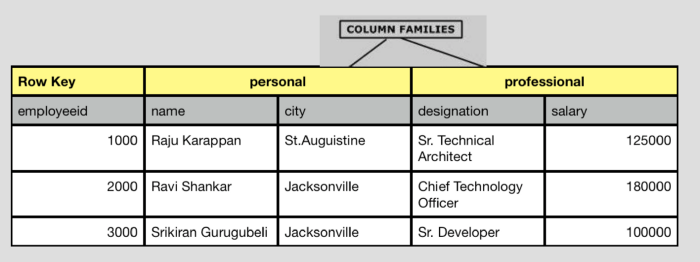
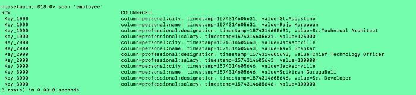
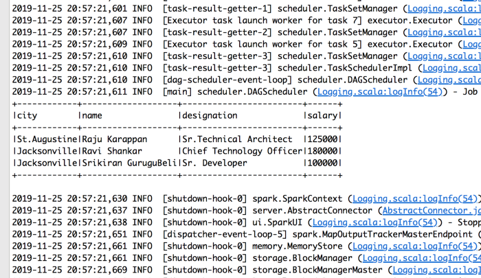

# How to create Spark Dataframe on HBase table
````text
Apache HBase and Hive are both data stores for storing unstructured data. 
HBase is a distributed, scalable, NoSQL big data store that runs on a Hadoop cluster. 
HBase can host very large tables — billions of rows, millions of columns — 
and can provide real-time, random read/write access to Hadoop data, 
whereas Hive is not ideally a database but a map-reduce based SQL engine that runs on top of Hadoop.

In many projects, It's common to read HBase data and process and land data into HDFS /DBs. 
Most easier and common method, many of us adapted to read Hbase is to create a Hive view 
against the Hbase table and query data using Hive Query Language or read HBase data using Spark-HBase Connector.

The caveat in using the Hive is every time you run Hive QL, 
it runs a map-reduce job to retrieve the result set. 
Better approach is to query data directly from Hbase and compute using Spark. 
In this reading let’s explore how to create spark Dataframe from Hbase database table without using 
Hive view or using Spark-HBase connector. This blog is more code oriented and the explanation 
are given as code comments.
````

### Step 1. Let’s create the following employee table in HBase Database.
````text
Given below is a sample schema of a table named “employee”. 
It has two column families: “personal” and “professional”.
````

````text
You can create this table using HBase shell as shown below.
````
````shell script
hbase(main):005:0> create 'employee', 'personal', 'professional'
0 row(s) in 1.2670 seconds

=> Hbase::Table - employee
hbase(main):006:0> list
TABLE

employee
````

### Step 2. Insert Data into employee table
````text
You can insert data into HBase table using Java API or HBase Shell.

- 2.1. Insert Data Using HBase Shell.
  Using put command, you can insert rows into an HBase table.
````
````shell script
hbase(main):007:0> put 'employee', '1000','personal:name','Raju Karappan'
0 row(s) in 0.2670 seconds

hbase(main):007:0> put 'employee', '1000','personal:city','St.Augustine'
0 row(s) in 0.0040 seconds

hbase(main):007:0> put 'employee', '1000','professional:designation','Sr. Technical Architect1'
0 row(s) in 0.0040 seconds

hbase(main):007:0> put 'employee', '1000','professional:salary','125000'
0 row(s) in 0.0040 seconds

base(main):007:0> put 'employee', '2000','personal:name','Ravi Shankar'
0 row(s) in 0.2670 seconds

hbase(main):007:0> put 'employee', '2000','personal:city','Jackonville'
0 row(s) in 0.0040 seconds

hbase(main):007:0> put 'employee', '2000','professional:designation','Chief Technology Officer'
0 row(s) in 0.0040 seconds

hbase(main):007:0> put 'employee', '2000','professional:salary','180000'
0 row(s) in 0.0040 seconds

base(main):007:0> put 'employee', '3000','personal:name','Srikiran GuruguBeli'
0 row(s) in 0.2670 seconds

hbase(main):007:0> put 'employee', '3000','personal:city','Jackonville'
0 row(s) in 0.0040 seconds

hbase(main):007:0> put 'employee', '3000','professional:designation','Sr. Developer'
0 row(s) in 0.0040 seconds

hbase(main):007:0> put 'employee', '3000','professional:salary','100000'
0 row(s) in 0.0040 seconds
````
````text
- 2.2. Insert Data using Java API and Scala.
  You can insert data into Hbase using the add() method of the Put class. 
  All of these classes belong to the org.apache.hadoop.hbase.client package. 
  See the scala program below to create data in “employee” Table of HBase.
````
````scala
object HbaseTest {

  def main(args: Array[String]): Unit = {
    import org.apache.hadoop.hbase.HBaseConfiguration

    val conf = HBaseConfiguration.create()
    conf.set("hbase.zookeeper.quorum","localhost")
    conf.set("hbase.rootdir","file:///Users/hadoop/dev/hbase-2.2.2/hbasestorage")
    conf.set("hbase.zookeeper.property.clientPort","2181")
    conf.set("zookeeper.znode.parent","/hbase")
    conf.set("hbase.unsafe.stream.capability.enforce","false")
    conf.set("hbase.cluster.distributed","true")

    // Create a new Hbase DB connection
    import org.apache.hadoop.hbase.client.Connection
    import org.apache.hadoop.hbase.client.ConnectionFactory
    import org.apache.hadoop.hbase.client.Put
    import org.apache.hadoop.hbase.util.Bytes

    val conn = ConnectionFactory.createConnection(conf)

    /*******************Insert Record into HBase table**************************/
    import org.apache.hadoop.hbase.TableName

    val tableName = "employee"
    val table = TableName.valueOf(tableName)
    val HbaseTable = conn.getTable(table)

    // Let set the column Families
    val cfPersonal = "personal"
    val cfProfessional = "professional"

    // Lets build the list of records to insert
    val records: List[Map[String, Any]] = List(Map("id" -> 1000,
    "name" -> "Raju Karappan",
    "city" -> "St.Augustine",
    "designation" -> "Sr.Technical Architect",
    "salary" -> 125000),
      Map("id" -> 2000,
        "name" -> "Ravi Shankar",
        "city" -> "Jacksonville",
        "designation" -> "Chief Technology Officer",
        "salary" -> 180000),
      Map("id" -> 3000,
        "name" -> "Srikiran GuruguBeli",
        "city" -> "Jacksonville",
        "designation" -> "Sr. Developer",
        "salary" -> 100000))

    // Iterate through each record to insert
    records.foreach(row => {
      // Prepare column values
      val keyValue = "Key_" + row.getOrElse("id", "NULL")
      val transRec = new Put(Bytes.toBytes(keyValue))
      val name = row.getOrElse("name", "NULL").toString
      val city = row.getOrElse("city", "NULL").toString
      val salary = row.getOrElse("salary", 0).toString
      val designation = row.getOrElse("designation", "NULL").toString

      /***********Add the specified column and value, with the specified timestamp as its version to this Put operation***************/

      // Add name to the personal column Family
      transRec.addColumn(Bytes.toBytes(cfPersonal), Bytes.toBytes("name"), Bytes.toBytes(name))
      // Add city to the personal column Family
      transRec.addColumn(Bytes.toBytes(cfPersonal), Bytes.toBytes("city"), Bytes.toBytes(city))
      // Add designation to the personal column Family
      transRec.addColumn(Bytes.toBytes(cfPersonal), Bytes.toBytes("designation"), Bytes.toBytes(designation))
      // Add salary to the personal column Family
      transRec.addColumn(Bytes.toBytes(cfPersonal), Bytes.toBytes("salary"), Bytes.toBytes(salary))

      // Insert record into HBase
      HbaseTable.put(transRec)
    })

    // Close Hbase table thread to Releases any resources held or pending changes in internal buffers.
    HbaseTable.close()
    conn.close()
  }
}
````

### Step 3. Let’s check whether records are inserted.
````text
Open an HBase shell and type command ‘scan’ as follows.
````


### Step 4. Next let’s retrieve the employee table data using Spark DataFrame.
````scala
import org.apache.spark.sql.SparkSession

object HbaseDataframe {

  def main(args: Array[String]): Unit = {
    import org.apache.hadoop.hbase.HBaseConfiguration

    // Create Spark Session
    val spark = SparkSession
      .builder()
      .appName("HbaseDataframe")
      .master("local[*]")
      .getOrCreate()

    // Set HBase configuration parameters using HBaseConfiguration.create() method
    val conf = HBaseConfiguration.create()
    conf.set("hbase.zookeeper.quorum", "localhost")
    conf.set("hbase.rootdir","file:///Users/hadoop/dev/apps/hbase-2.2.2/hbasestorage")
    conf.set("hbase.zookeeper.property.clientPort", "2181")
    conf.set("zookeeper.znode.parent", "/hbase")
    conf.set("hbase.unsafe.stream.capability.enforce", "false")
    conf.set("hbase.cluster.distributed", "true")

    // Create HBase connection using ConnectionFactory
    import org.apache.hadoop.hbase.client.ConnectionFactory
    import org.apache.hadoop.hbase.util.Bytes

    val conn = ConnectionFactory.createConnection(conf)

    // Create an HBase table instance
    import org.apache.hadoop.hbase.TableName
    val tableName = "employee"
    val table = TableName.valueOf(tableName)
    val HbaseTable = conn.getTable(table)

    /**
      * One of the ways to get data from HBase is to scan.
      * Scan allows iteration over multiple rows for specified attributes.
      * Initiate a client Scan instance and setup a filter criteria to retrieve
      * the rows beginning with “Key”.
      * Next add columns to be included in the result set.
      * The following is an example of a Scan on a Table instance.
      */
    // search HBase records based on the key values starting "Key"
    import org.apache.hadoop.hbase.client.Scan
    import org.apache.hadoop.hbase.filter.PrefixFilter
    import org.apache.hadoop.hbase.filter.Filter

    // Initiate a new client scanner to retrieve records
    val scan = new Scan()

    // Set the filter condition and
    val prfxValue = "Key"
    val filter: Filter = new PrefixFilter(Bytes.toBytes(prfxValue))

    // Set the filter condition
    scan.setFilter(filter)

    // Scanning the required columns
    scan.addColumn(Bytes.toBytes("personal"), Bytes.toBytes("name"))
    scan.addColumn(Bytes.toBytes("personal"), Bytes.toBytes("city"))
    scan.addColumn(Bytes.toBytes("professional"), Bytes.toBytes("designation"))
    scan.addColumn(Bytes.toBytes("professional"), Bytes.toBytes("salary"))

    // Retrieve Records
    val scanner = HbaseTable.getScanner(scan)

    /**
      * Iterate through each row and fetch data from each cell
      * and store the result set in a List[Map[String,String]] collection.
      */
    import org.apache.hadoop.hbase.util.Bytes
    import org.apache.hadoop.hbase.CellUtil

    // Iterate through the results and store the results into resValues Collection
    var resValues: List[Map[String, String]] = List()
    import scala.collection.JavaConverters._
    scanner.asScala.foreach(result => {
      var resultMap: Map[String, String] = Map()
      val cells = result.rawCells()
      for(cell <- cells) {
        val col_name = Bytes.toString(CellUtil.cloneQualifier(cell))
        val colValue = Bytes.toString(CellUtil.cloneValue(cell))
        resultMap = resultMap ++ Map(col_name -> colValue)
      }

      val resultLst = List(resultMap)
      resValues = resValues ::: resultLst
    })

    // Destroy instances of Scan, Table and Connection to release any resources held
    scanner.close()
    HbaseTable.close()
    conn.close()

    // Create a Spark DataFrame using the List[Map[String, String]]
    val colValLstMap = resValues

    // Get column names from the Map
    val colList = colValLstMap.map(x => x.keySet)

    // Get all unique columns from the list
    val uniqColList = colList.reduce((x, y) => x ++ y)

    val emptyString = ""

    // Add empty values for the non existing keys
    val newColValMap = colValLstMap.map(eleMap => {
      uniqColList.map(col => { (col, eleMap.getOrElse(col, emptyString))}).toMap
    })

    import org.apache.spark.sql.types._ 
    import org.apache.spark.sql.Row

    // Create your rows
    val rows = newColValMap.map(m => Row(m.values.toSeq: _*))
    
    // Create the schema from the header
    val header = newColValMap.head.keys.toList
    val schema = StructType(header.map(fieldName => StructField(fieldName, StringType, true)))
    val sc = spark.sparkContext
    
    // create your rdd
    val rdd = sc.parallelize(rows)
    
    // create your dataframe
    val resultDF = spark.sqlContext.createDataFrame(rdd, schema)
    
    resultDF.show(10, truncate = false)
  }
}
````
````text
When you run the above code, resultDF.show will give the output as displayed below.
````


### Summary
````text
HBase will be a good candidate If you have hundreds of millions or billions of rows. 
Traditional RDBMS would be a better choice, If you only have a few thousand/million rows 
as all of your data might wind up on a single node (or two) and the rest of the cluster may be sitting idle.
HBase Table instances are not thread-safe. Only one thread can use an instance of Table at any given time. 
When creating Table instances, it is advisable to use the same HBaseConfiguration instance.
Connections are heavyweight objects but thread-safe so you can create one for your application and keep the instance around. 
Table, Admin and RegionLocator instances are lightweight. 
Create as you go and then let go as soon as you are done by closing them.
````
